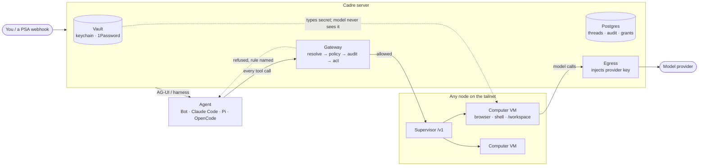

<div align="center">

# Cadre

**A self-hosted control plane for AI coworkers you can actually trust with access.**

Every agent gets a real computer of its own — a VM on your Mac or a box on your tailnet.
Every action is decided by your policy before it happens and recorded after.
The agent never holds the credentials it uses.

[Why](#why-cadre) · [What's new in the fork](#what-cadre-adds) · [How it works](#how-it-works) · [Quick start](#quick-start) · [Security model](#security-model) · [Status](#status)


</div>

---

## Why Cadre

I build automation for an IT service desk. The useful agents are the ones that touch real systems —
an admin console, a PSA ticket, a tenant's mail — and those are the ones nobody should hand a
password to.

The answer I trust in production is the one RPA platforms already use: **the agent never holds
privileged access.** A mediation layer holds scoped credentials, runs only what policy allows, logs
everything, and keeps a human on consequential actions. Cadre is that layer for general-purpose
agents:

- **Accountability over autonomy.** The gate lives above the agent, in code, not in the prompt.
- **Read and act are separated.** Consequential actions can require a person.
- **Blast radius is small and revocable.** One grant, one click, one audit row.
- **If you can't show it, it's a demo, not a system.** Every decision is on the record.

## What Cadre adds

Cadre is a fork of [CopilotKit/OpenBot](https://github.com/CopilotKit/openbot) (MIT). OpenBot
contributed the governed gateway — CEL policy that fails closed, write-only credentials, the audit
trail, take-the-wheel. Cadre makes it **sovereign, multi-machine, and harness-agnostic**:

| Area | OpenBot v0.0.4 | Cadre |
|---|---|---|
| **Threads & memory** | Hosted CopilotKit Intelligence (license + API key) | Postgres-native runner; no hosted dependency, nothing leaves your box |
| **Computers** | One Docker container per Bot | Versioned **Supervisor Contract** (`/v1`) with pluggable backends: Docker/gVisor, and **Apple `container` VMs** on macOS |
| **Capacity** | Unbounded | Declared CPU/RAM "slices" per machine and per computer; `429 + Retry-After` on exhaustion; live utilization |
| **Machines** | One host | **Mesh**: token enrollment of nodes over the tailnet, `cadre move <bot> <node>` carries a workspace + browser profile between machines |
| **Interface** | Web app | Web app **or** the `cadre` CLI — init, up, chat (with computer tools), status, audit, nodes, move |
| **Agent harnesses** | AG-UI Bots | Also **Claude Code, Pi, and OpenCode** as managed harnesses, inside the same boundaries |
| **Instructions** | Per-Bot prompts and skills | **Artifact registry**: versioned instructions and skills, projected per harness (`CLAUDE.md`, `AGENTS.md`) and assigned to workspaces |
| **Model keys** | In the environment | **Egress credential injection**: the provider key is added on the way out; a computer can reach its model without ever holding the key |
| **Credentials** | Write-only store | **Connections vault**: host keychain custody, 1Password via `op` on the host, supervised sign-in with session capture, Microsoft device-code sign-in (no password passes through Cadre) |
| **Context leaks** | — | Found and fixed: accessibility snapshots could echo a secret the server had just typed back into model context. Snapshots are now scrubbed. |
| **Runs** | Chat-initiated | **Triggers**: webhooks that start runs on their own, e.g. a PSA ticket |
| **Durability** | — | Survives reboots, crashes and lost volumes without losing threads |

## How it works



Everything a coworker does to a computer, a file, an MCP server or a component goes through one
gateway. It resolves the target from a server-held snapshot, evaluates CEL policy (deny before allow,
a broken rule refuses), writes the audit row, and only then acts. There is no path that acts without
the record existing first.

## Quick start

Requirements: macOS or Linux, [Bun](https://bun.sh) **1.3.x** (the repo pins it), Docker, and an
OpenAI-compatible model endpoint and key.

```sh
git clone https://github.com/mejohnc-ft/cadre && cd cadre
cp .env.example .env              # add OPENAI_API_KEY (and OPENAI_COMPATIBLE_BASE_URL if not OpenAI)
bun install
bash scripts/start.sh
```

Open <http://localhost:3010>, then:

1. `/bot` → *"Open news.ycombinator.com and tell me the top story."* Watch its screen.
2. `/admin/audit` — every navigate, click and screenshot is a row, decided before it happened.
3. `/admin/boundaries` — add `deny: ["page.host == 'news.ycombinator.com'"]`, ask again, read the refusal.

**No Docker, no web app (Apple silicon, macOS 26):** every computer and the database run in their
own lightweight VM.

```sh
export PATH="$PWD/bin:$PATH"
cadre init --cpus 4 --memory-gb 8   # dedicate a slice of this Mac
cadre up
cadre chat general-assistant "hello"
cadre status && cadre audit
```

**More than one machine:** `cadre node token` on the server, `scripts/install-node.sh` on a Linux box,
`cadre node join …`, then `cadre move general-assistant <node>`. A move exports, restores, stops the
source and only then records the placement, so a failure part-way leaves the agent where it was.
`scripts/install-server.sh` turns an Ubuntu/Debian machine into a complete always-on deployment,
published to the tailnet only.

Full walkthrough: [docs/using.md](docs/using.md). A worked service-desk scenario:
[docs/demo-incident-buddy.md](docs/demo-incident-buddy.md).

## Security model

What Cadre enforces, and what it does not claim.

- **Policy before action.** CEL rules over `tool.name`, `page.host`, `element.*`, `file.*`, `mcp.*` and more; a missing policy permits nothing.
- **Credentials stay on the host.** The agent requests, a person approves, the secret is typed into the page by the server and is not retained in context. Provider keys are injected at egress.
- **Humans can take the wheel.** Control handoff is audited; while a person drives, agent actions are refused rather than queued.
- **Computers are isolated** per agent (VMs on macOS, containers with optional gVisor on Linux), bound to loopback or the tailnet, token-guarded.
- **Known limits.** This is access control, not a guarantee against prompt injection: an allowed action can still be the wrong one, which is why consequential actions should stay behind a human gate. Session cookies captured for a connection live inside that agent's computer. Alpha software — run it on test tenants.

## Status

Alpha, in daily use on my own machines (a Mac, a ROCm workstation, and a DGX Spark on one tailnet).
The build order is in [docs/roadmap.md](docs/roadmap.md) and the product intent in [docs/prd.md](docs/prd.md):

- [x] **M0** Sovereign fork — Postgres threads, no hosted dependency
- [x] **M1** Supervisor Contract v1 — budgets, capacity, exec and bundle verbs
- [x] **M2** Two runtimes — Apple `container` VMs and the CLI
- [x] **M3** Mesh — enrollment, placement, moving agents between machines
- [x] **M4** Control plane — harness registry, artifact registry, provider routing, egress injection, vault
- [ ] Evals: task success, false-action rate and boundary integrity measured per release

## Development

```sh
bun run format:check && bun run lint && bun run typecheck && bun run test
OPENBOT_SMOKE=1 bun test tests/smoke   # navigate → screenshot → audit → deny → refusal, against a live stack
```

Environment variables keep their upstream `OPENBOT_*` names so upstream fixes merge cleanly.
Reference docs: [architecture](docs/architecture.md) · [configuration](docs/configuration.md) ·
[development](docs/development.md) · [deployment](docs/deployment.md) · [changelog](CHANGELOG.md).

## Credits & license

Built on [OpenBot](https://github.com/CopilotKit/openbot) by CopilotKit and the
[AG-UI](https://github.com/ag-ui-protocol/ag-ui) protocol. MIT — see [LICENSE](./LICENSE).
Original work © CopilotKit; Cadre changes © Jonathan Christensen.

Built by [Jonathan Christensen](https://mejohnc.org).
